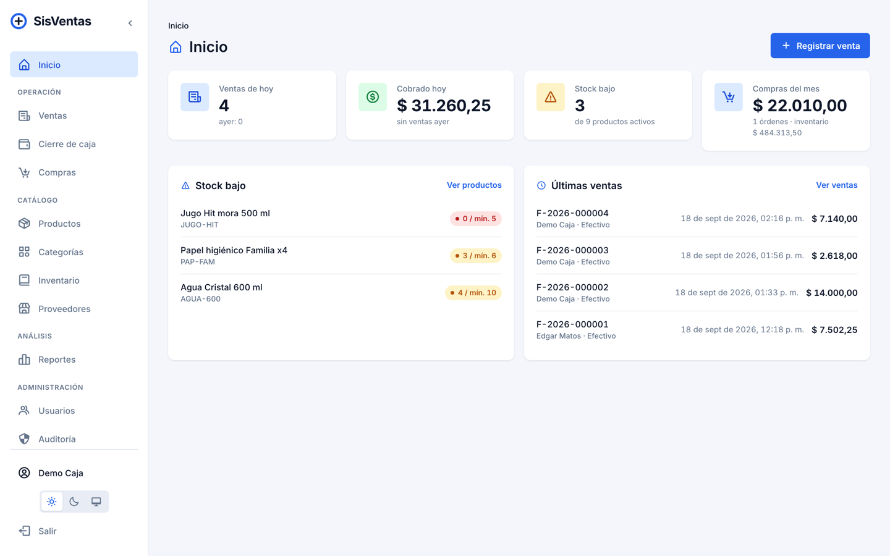
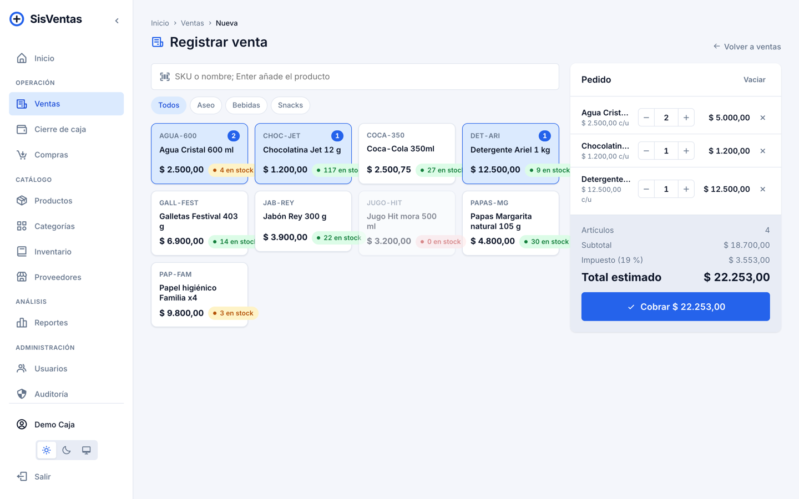
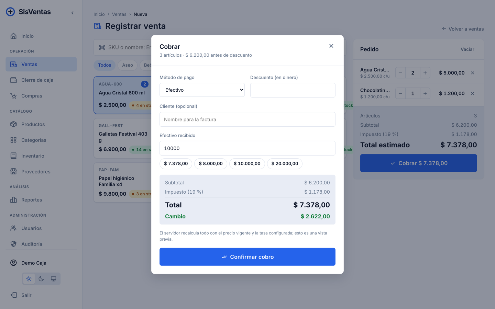
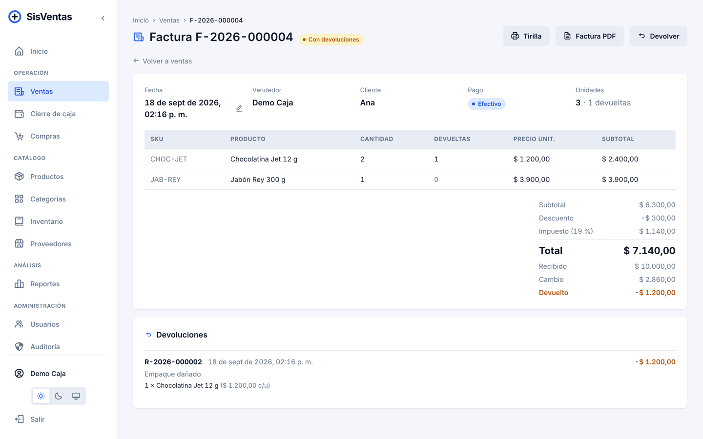
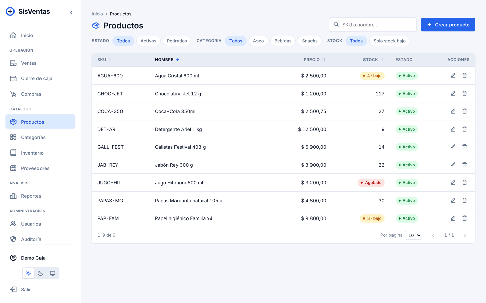
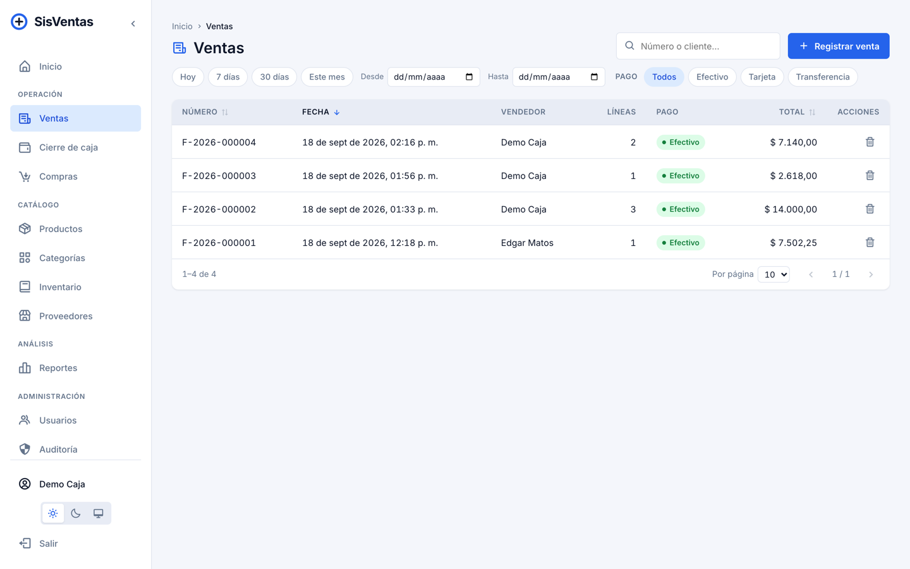
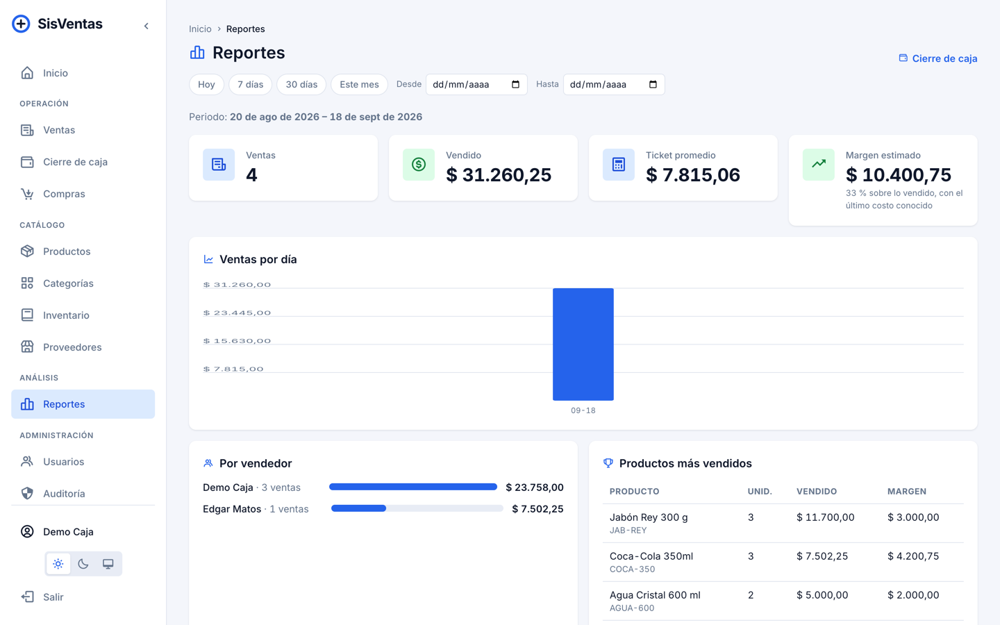
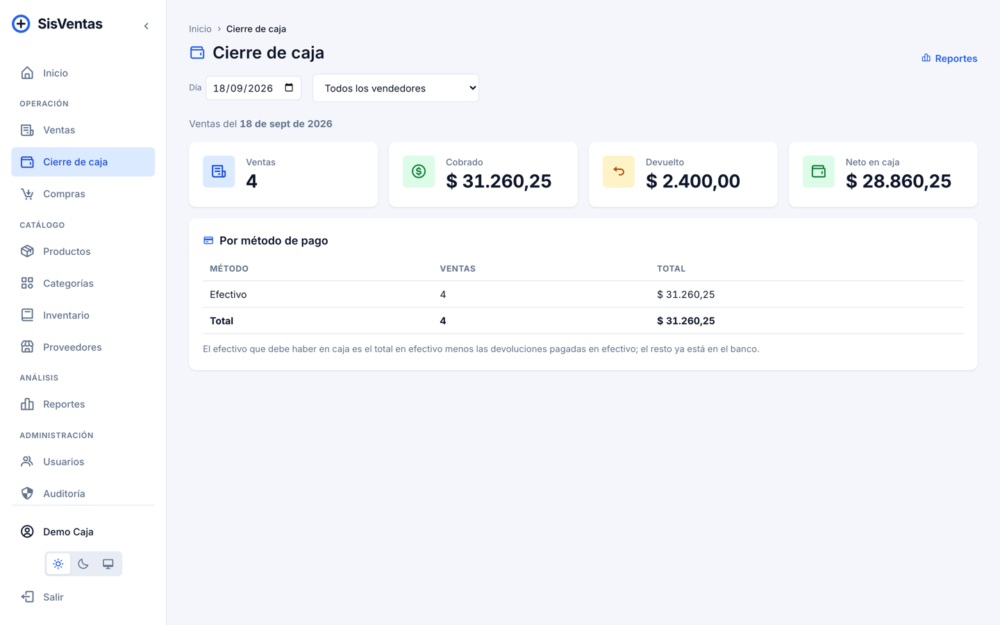
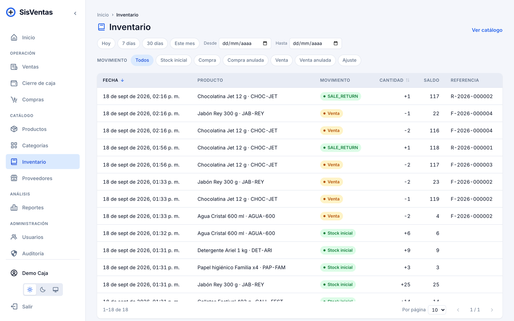
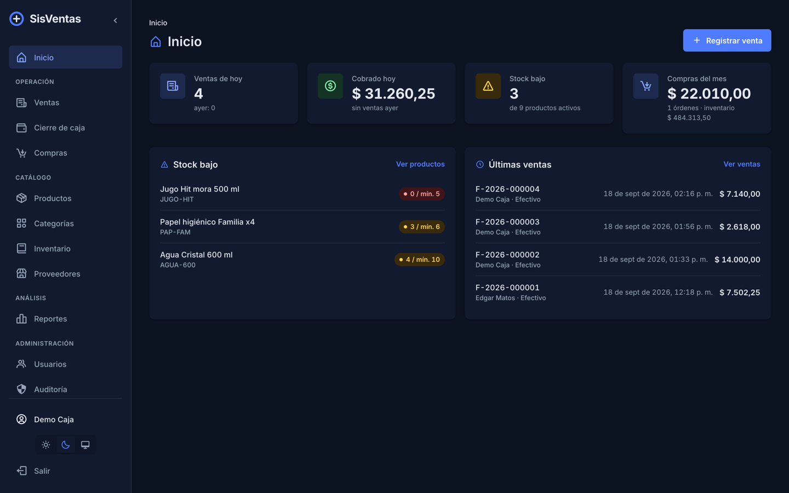

# SisVentas — Panel

Frontend for the [SisVentas API](https://github.com/matosr96/sisventas-api): a small point of sale
with a product catalog, supplier purchases, sales with invoices, a stock ledger and user management.

Like the API, this is a **personal project** and a reference implementation of one specific way of
building a frontend: a one-way dependency chain, one file per operation, a closed dependency list,
component-scoped CSS driven by design tokens with light and dark themes, and every screen covering
its loading, error, empty and data states.

> Code is in English; the interface, comments and internal docs are in Spanish.

## Screenshots

| Home | Point of sale |
| --- | --- |
|  |  |

| Checkout | Sale detail with a partial return |
| --- | --- |
|  |  |

| Products | Sales |
| --- | --- |
|  |  |

| Reports | Cash closing |
| --- | --- |
|  |  |

| Inventory ledger | Dark theme |
| --- | --- |
|  |  |

## What it does

- **Sign in** with the API's JWT; roles `USER` (seller) and `ADMIN` drive the menu, the routes and a
  "no permission" page. The session refreshes the user on start, warns five minutes before the token
  expires, signs out when it does, and can be closed on every device from the profile.
- **Home**: today's sales and takings compared with yesterday, low-stock count, this month's
  purchases and inventory value, all aggregated by the API, plus the low-stock and latest-sales lists.
- **Point of sale**: product tiles with images and stock badges, search by SKU or name resolved by
  the API (barcode-scanner friendly: Enter adds the product), category chips, a sticky order panel
  with quantity steppers, and a **checkout step** with payment method, discount, customer name,
  cash received with quick amounts and the change. Lines rejected for stock are marked, not lost.
- **Sales**: server-side list with date range, payment method and text filters; detail with the
  totals breakdown (subtotal, discount, tax, total, received, change), **partial returns** to stock,
  date correction, A4 invoice PDF and an **80 mm receipt** sent straight to the printer.
- **Purchases**: same layout with the supplier and the unit cost paid per line; date correction;
  voiding returns the units.
- **Products**, **categories**, **suppliers**: server-side lists with sortable columns, filter chips
  (status, category, low stock) and drawers for the long forms; the product page shows its stock
  ledger and takes manual adjustments with a mandatory reason. Stock is never edited by hand.
- **Inventory**: the global stock ledger filtered by movement type and dates.
- **Reports**: sales report over a date range (totals, average ticket, estimated margin, daily
  chart, by seller, top products) and a **cash closing** per day and seller by payment method.
- **Users** (admin): create with an initial role, edit names and photo, change role or status,
  reset a forgotten password. **Audit** (admin): every write the API recorded.
- **Profile**: edit own names and photo, change password, log out everywhere.
- Light and dark themes, following the system by default; installable (web manifest).

### Interface conventions

The panel follows the patterns that current admin and POS products share (Shopify admin and POS,
Square, Carbon and Atlassian design guidelines), without any UI library:

- Tables: sticky header, click-to-sort columns (only the ones the API can sort), right-aligned
  tabular figures, status **badges**, always-visible row actions, page size selector and a result
  range. Paging, sorting, search (debounced) and filters all happen **on the server**.
- Every list has four states — **skeleton** while loading, an error notice, an empty state with a
  call to action, and a distinct **"no results"** state that clears the search and filters.
- Short forms open in a centered modal; long ones (product, user, returns) in a **side drawer**
  that keeps the list visible. Destructive actions ask through a **modal confirm dialog** with a
  promise (`await confirm.ask(...)`), never a toast that can expire.
- Document pages put the status badge next to the number and the actions in the header, with the
  totals block aligned to the right.
- Design tokens in `src/styles.css`: a 14px base, small radius for controls and a larger one for
  surfaces, semantic accents (blue action, green ok, amber warning, red danger) defined for both themes.
- Page titles per route, a "no permission" page, 401/403 explained once by the interceptor,
  double-submit guards on every form, and a reload of what is on screen when the tab regains focus.

## Quick start

Requires Node 24, pnpm 10 and the API running locally (see its README; add
`http://localhost:4200` to its `CORS_ORIGINS`).

```bash
pnpm install
pnpm start          # http://localhost:4200
pnpm test           # unit tests (vitest)
pnpm lint
pnpm build          # dist/sisventas-app/browser
```

The API URL is read at startup from `public/config.json` (`{ "apiUrl": "http://localhost:8080/api/v1" }`),
so the same build serves any environment. Sign in with a user created through the API; an `ADMIN`
sees purchases, suppliers, users and the audit.

### Running with Docker

```bash
docker build -t sisventas-app .
docker run --rm -p 4300:80 -e API_URL=http://localhost:8080/api/v1 sisventas-app
```

Or `docker compose up`. The image (nginx with SPA fallback and cache headers) writes `config.json`
from `API_URL` when the container starts. Every green build on `main` publishes
`ghcr.io/matosr96/sisventas-app` (`latest`, `sha-<commit>`, and the version on `v*` tags).

## Stack

Angular 22 (standalone components, signals, zoneless) · TypeScript · `HttpClient` · Router ·
component styles with CSS custom properties · vitest for unit tests. No UI, forms, charts, icons or
state libraries: the dependency list is closed on purpose. Icons come from boxicons over a CDN; the
report chart is hand-written SVG.

Gate: `pnpm lint && pnpm test && pnpm build`. CI runs the same, plus `pnpm audit` and a Docker build,
and publishes the image on `main`.

## Architecture

```
src/app/
├── api/            runtime API URL (config.json), auth interceptor (token, 401/403), QueryClient
├── services/       one @Injectable per API resource — the only place that touches HttpClient
├── entities/       interfaces, DTOs, empty states and the ListQuery → params mapping
├── store/          AuthStore (session, token expiry), UiStore (theme, sidebar), SettingsStore (business)
├── operations/     one function per operation: the unit of business logic on the client
├── pages/          one folder per screen, with create/ update/ detail/ new/ subfolders
├── components/     layout, sidebar, shared kit (generic) and container kit (domain)
├── guards/         authGuard, roleGuard(...roles)
├── constants/      routes, screen names, resource keys, error messages
└── utils/          money/date formatting and error translation
docker/             nginx.conf (SPA fallback, cache headers) and the entrypoint that writes config.json
docs/screenshots/   the images above
```

The dependency chain runs one way: **page → operation → (service | store) → HttpClient**. Pages never
call the API; operations never know URLs; services never show toasts. Server state is an Angular
`resource` registered in a small `QueryClient`, so a mutation invalidates every screen showing that
resource by key — the key is the API resource name. Lists are `serverList` operations: page, page
size, sort, debounced search and filter chips live in signals and travel as query params; the API
does the work, the client never scans a collection.

## Contract with the API

| Operation | Request | Response |
| --- | --- | --- |
| List | `GET /<resource>?page=&limit=&sort=&dir=&search=&<filters>` | `{ count, page, pages, items }` |
| Read | `GET /<resource>/{id}` | entity |
| Create | `POST /<resource>` | created entity |
| Update | `PUT /<resource>/{id}` | updated entity |
| Delete | `DELETE /<resource>/{id}` | 204 |
| Sign in | `POST /auth/signin` `{ username, password }` | `{ accessToken, tokenType, user }` |
| Settings | `GET /settings` | `{ businessName, currency, taxRate }` |
| Reports | `GET /reports/summary`, `/reports/sales?from&to`, `/reports/closing?date&userId` | aggregates |
| Returns | `POST /sales/{id}/returns` `{ reason, items: [{ saleItemId, quantity }] }` | the return |
| PDF | `GET /sales/{id}/pdf?format=invoice\|receipt` | `application/pdf` |
| Sessions | `POST /users/me/logout-all`, `PUT /users/{id}/password` | 204 |

Errors arrive as `{ "message": "<code>" }` and are translated to Spanish in one place
(`constants/error-messages.ts`); the checkout reacts to `621` (insufficient stock) by marking the
line. Money is formatted in the currency the API declares in `/settings`.

## Tests

```bash
pnpm test                 # vitest, once
pnpm test --watch         # while developing
```

Fourteen unit tests over the pieces that hold logic: query-to-params mapping, money and date
formatting, API error translation and codes, JWT expiry reading, the table in client and server
mode (sorting, paging, emitted queries, non-sortable keys), the server list (debounce, filters,
clearing) and the POS cart and checkout arithmetic (stock caps, discount, tax, total, change).
Screens are verified against the real API in the browser before a release; there are no end-to-end
tests.

## Still out of scope

- **Hosting**: the image is published, nothing runs it.
- **Offline mode**: the panel is installable but needs the API online.
- **Customers as an entity, multi-store, multi-currency**: the API keeps one business and one
  currency; the customer is a free-text name on the sale.

## License

MIT — see [LICENSE](LICENSE).
